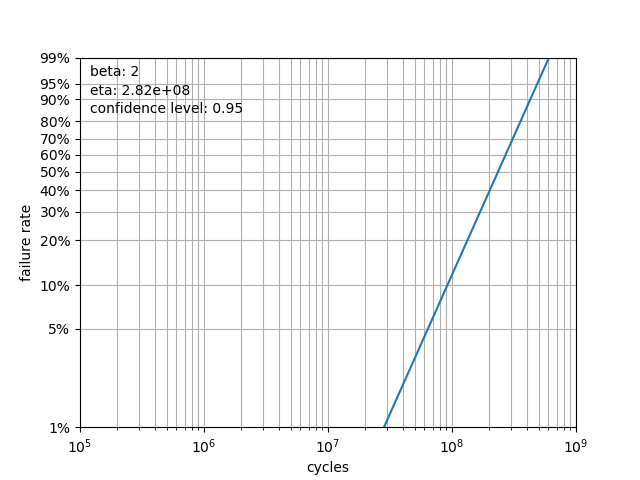

# Temporary Disclaimer

I (slightlynybbled) forked this repository - including the readme - and I am currently modifying the library along with the readme to improve useability.  The below contains artifacts from the original readme that were written by the original author.  Where I have modified the library, I have modified the readme to reflect those changes.

As I advance in refactoring the library into a more complete and useable package, I will eventually replace all of the text of the readme with appropriate substitutions and remove this temporary disclaimer.

# Weibull Reliability Analysis

This is a rough collection of Weibull analysis routines.  I make no claim to the accuracy.

Routines are for low sample sizes.  I believe at large sample sizes, maximum likelihood methods are more accurate.  The Weibull fits here are done as Y on X and X on Y regressions - the equivalent to graphing on Weibull paper.  The class can handle right-censored data (data in which the test was stopped before all units have experienced failure).

A class for Weibayes analysis is also included.

Also included is are a few methods to determine test time or number of samples.

I wrote this while working at a manufacturing company.  Before I could polish it up, I left for a completely different job.  I doubt I will use this again, but I wanted to pull the work in progress out of the iPython notebook where it was and stick it in a file.  As a result, there are some duplicate functions in the file.  I couldn't be bothered to clean those up...

# Weibull Basic Fitting

The most fundamental weibull analysis is to calculate the values of beta and eta for a given list of life data.

Censored data can be fit as well as uncensored data.  Four fits are performed:

A basic example is shown here, but more complete examples may be found within the [examples](examples/) directory.

    import weibull
    
    # take real data and supply it for the failure times,
    # leaving right-censored data as None
    fail_times = [None] * 10
    fail_times[7] = 1034.5
    fail_times[8] = 2550.9
    fail_times[6] = 3043.4
    
    analysis = weibull.Analysis(fail_times)
    analysis.plot()
    
    print(f'beta: {analysis.beta}\teta: {analysis.eta}')

# Test design

The `Design` class is to be utilized for two scenarios:

 - determine the required number of units to prove the target reliability given a test cycles/duration
 - determine the required number of cycles/duration to prove the target reliability given a number of units
 
To begin, first import and instantiate the `Designer`, which is the utility for the test designer.  There are several parameters to consider and all of them are requirements or assumptions that must be entered as parameters for the `Designer` class:

 - `target_cycles` - the target to be proven in hours/days/weeks/cycles
 - `reliability` - defaults to 0.9
 - `confidence_level` - defaults to 0.95
 - `expected_beta` - an initial assumption for beta (defaults to 2)

Shown are two example calculations for a target lifetime of 10000 hours with a reliability of 0.9 at a confidence level of 0.5 and beta assumption of 1.5:

    import weibull
    
    designer = weibull.Design(
        target_cycles=10000,
        reliability=0.9,
        confidence_level=0.90,
        expected_beta=1.5
    )
    
    # The 'test_cycles' parameter can be in any units.
    # Days, weeks, hours, cycles, etc., so long
    #   as the target unit is consistent
    print(f'Minimum number of units for 10000 hour run: {designer.num_of_units(test_cycles=10000)}')
    print(f'Minimum hours for 20 units: {designer.num_of_cycles(num_of_units=20)}')

# Weibayes

Use Weibayes analysis to assist with designing your test.

You have a product that needs to be tested to B2 life of 40 million time units with a confidence limit of 95%.  The product had an expected beta of 2 (lots of historical data there).  B2 life is the same as 98% survival. 

Using the weibull test `Design` class, we need to run 62 units (the limit of our test rig) for 62 million time units with no failures:

    import weibull
    
    designer = weibull.Design(
        target_cycles=40e6,
        reliability=0.98,
        confidence_level=0.95,
        expected_beta=2
    )
    
    print(f'Minimum hours for 62 units: {designer.num_of_cycles(num_of_units=62)}')
    
Result:

    61860134.45191945

Weibayes analysis on the data would arrive at the same result.

    import weibull
    
    # we want N units to run for H hours each
    N = 62
    H = 62.0e6
    
    run_times_desired = [H] * N
    weibayes = weibull.Weibayes(run_times_desired, confidence_level=0.95, beta=2)
    
    print(f'B2 life: {weibayes.b(2)}')
    
Results:

    B2 life: 40090439.86038491
    
Note that this `B2` matches very closely with `target_cycles` value found in the above iteration of the `Design` class.

We can further plot the data using `weibayes.plot()` resulting in:

# Contributions

Initial work on this repository was done by user [tgray](https://github.com/tgray).  You can still peruse the [original repository](https://github.com/tgray/weibull).
