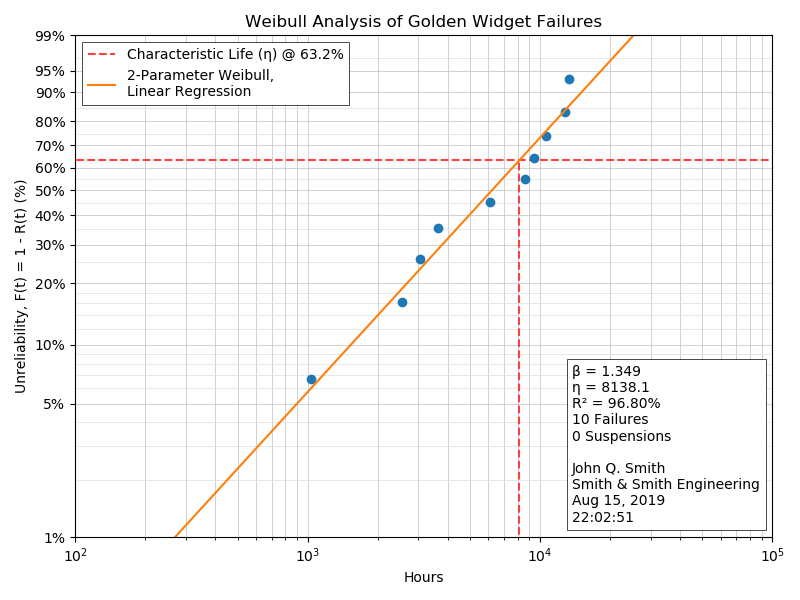
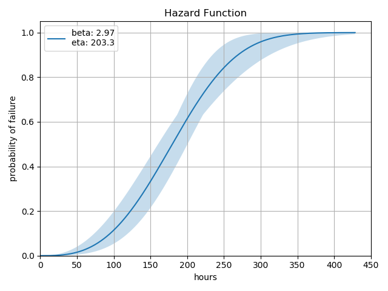
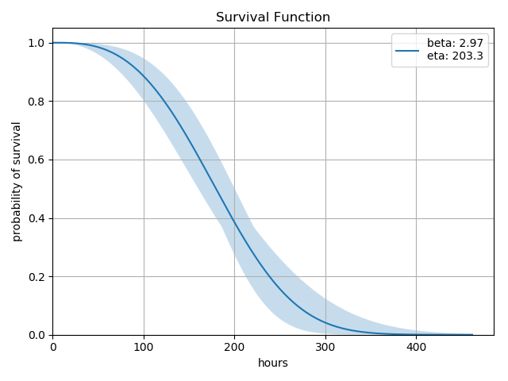

# Purpose

This package is intended to ease reliability analysis using the Weibull distribution, which is the most common method of reliability analysis.  Check out the [documentation](http://weibull.readthedocs.io/en/latest) for more information!

# Project Maturity

I am making every effort to ensure that every release is technically sound; however, it is possible that something is technically incorrect!  It is up to the user to verify functionality for themselves.

In addition, the interface is still maturing as I run it through different use cases and there will likely be breaking changes until the 1.0 release.  There will not be any breaking changes until major release numbers after that.

Most of the functionality is backed up by tests with the exception of plotting functionality.

# Gallery

## Probability Plot

## Hazard Function

## Survival Function

# Contributions

Contribution guidelines:

1. Fork the repository to your account.
2. Clone your account repository to your local development environment.
3. Create/checkout a new branch appropriately named by feature, bug, issue number, whatever.
4. Make your changes on your branch.  The ideal changes would:
 * have testing implemented using `pytest`
 * have working examples in the `examples` directory
 * have documentation in the `docs` directory
5. Push your changes to your github account.
6. Create a pull request from within github.

If you have created a feature branch and made your changes there, your pull request is much more likely to be accepted even if it doesn't have `pytest`, examples, and documentation.  If you have made the changes on the `master` branch, then it is expected to be a comprehensive pull request with testing, examples, and working documentation.

Initial work on this repository was done by user [tgray](https://github.com/tgray).  You can still peruse the [original repository](https://github.com/tgray/weibull).
